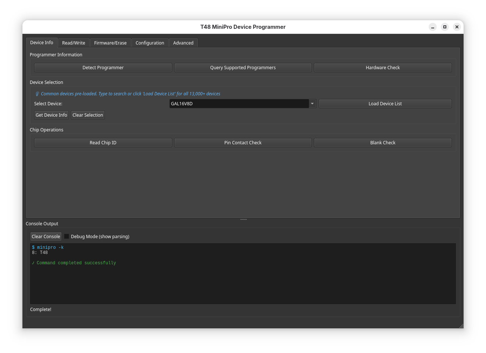

# 🚀 MiniPro GUI - GitHub Repository Ready!

Your complete project is ready to push to GitHub! Here's everything you need to know.

## 📦 What's Included

```
minipro-gui-project/
├── minipro_gui.py          # Main application (v1.3.3)
├── README.md               # Comprehensive documentation
├── QUICK_REFERENCE.md      # Handy cheat sheet
├── CHANGELOG.md            # Version history
├── CONTRIBUTING.md         # Contribution guidelines
├── GITHUB_SETUP.md         # Detailed GitHub setup guide
├── LICENSE                 # GPL v3 license
├── requirements.txt        # Python dependencies
├── .gitignore             # Git ignore rules
└── setup-github.sh         # Automated setup script ⭐
```

## 🎯 Quick Start - Three Ways to Set Up

### Option 1: Automated Script (Easiest!) ⭐

```bash
cd /path/to/minipro-gui-project
./setup-github.sh
```

The script will:
- ✅ Check prerequisites
- ✅ Guide you through authentication
- ✅ Initialize git repository
- ✅ Create initial commit
- ✅ Create GitHub repository
- ✅ Push everything automatically
- ✅ Optionally create v1.3.3 tag

Just follow the prompts!

### Option 2: GitHub CLI (One Command)

If you have `gh` installed:

```bash
cd /path/to/minipro-gui-project

# Initialize and commit
git init
git add .
git commit -m "Initial commit: MiniPro GUI v1.3.3"

# Create repo and push (one command!)
gh repo create minipro-gui --public --source=. --push
```

### Option 3: Manual Setup

See **GITHUB_SETUP.md** for detailed step-by-step instructions.

## 📋 Initial Commit Message

The setup uses this descriptive commit message:

```
Initial commit: MiniPro GUI v1.3.3

- Complete PyQt6 frontend for minipro CLI tool
- Real-time progress bar with stderr parsing
- Searchable device dropdown (13,000+ devices)
- Persistent settings with QSettings
- Debug mode for troubleshooting
- Dark theme UI with color-coded console
- Support for T48, TL866A/CS, TL866II+ programmers
```

## 🏷️ Recommended Repository Settings

### Basic Info
- **Name:** `minipro-gui`
- **Description:** `PyQt6 GUI for T48 MiniPro device programmer with real-time progress and 13K+ device support`
- **Topics:** `python` `pyqt6` `t48` `programmer` `gui` `minipro` `eeprom` `firmware` `chip-programmer`
- **License:** GNU GPL v3.0

### After Creating Repo
1. **Add Topics**: Click ⚙️ next to About section
2. **Create Release**: Tag v1.3.3 with release notes
3. **Enable Discussions**: Great for Q&A
4. **Add Screenshot**: Take a screenshot of the GUI and add to README

## 📸 Suggested Repository Description

```
A modern PyQt6 graphical interface for the minipro command-line tool. 
Features real-time progress updates, searchable device dropdown with 
13,000+ supported devices, persistent settings, and comprehensive 
chip programming support for T48, TL866, and compatible programmers.
```

## 🎨 Suggested Topics/Tags

Click these when setting up your repo:
- `python`
- `pyqt6`
- `gui`
- `t48`
- `tl866`
- `minipro`
- `programmer`
- `chip-programmer`
- `eeprom`
- `eprom`
- `spi-flash`
- `firmware`
- `electronics`

## 📝 After Initial Push

### 1. Create Your First Release (v1.3.3)

```bash
git tag -a v1.3.3 -m "Release v1.3.3: Real-time progress updates"
git push origin v1.3.3
```

Then on GitHub:
- Go to "Releases" → "Draft a new release"
- Choose tag: v1.3.3
- Title: "v1.3.3 - Real-Time Progress Updates"
- Copy release notes from CHANGELOG.md
- Publish!

### 2. Add a Screenshot

Take a screenshot of the GUI and add it to README:

```markdown
## Screenshots


```

### 3. Enable GitHub Features

**Discussions:**
- Settings → Features → Enable Discussions
- Great for Q&A and community support

**Issues:**
- Already enabled by default
- Add issue templates (optional)

**Wiki:**
- Can add extended documentation
- Tutorial pages, FAQs, etc.

## 🔄 Making Future Updates

```bash
# Make changes to your files

# Check what changed
git status

# Stage changes
git add .

# Commit with message
git commit -m "feat: Add new feature description"

# Push to GitHub
git push origin main
```

## 📚 Documentation Files Explained

### README.md
- **Main documentation** - Shows on repo homepage
- Installation instructions
- Usage guide
- Complete feature list
- Troubleshooting

### QUICK_REFERENCE.md
- **Cheat sheet** for users
- Quick workflows
- Common operations
- Keyboard shortcuts

### CHANGELOG.md
- **Version history**
- What's new in each version
- Bug fixes and improvements
- Links to releases

### CONTRIBUTING.md
- **For contributors**
- How to report bugs
- How to submit PRs
- Code style guidelines
- Development setup

### GITHUB_SETUP.md
- **This guide**
- Setup instructions
- GitHub features
- Best practices

### LICENSE
- **GPL v3** license text
- Matches minipro's license
- Required for open source

## 🤝 Community

After your repo is up:

### README Badges (Optional)

Add these to README.md:

```markdown


```

### Link to Upstream

Add a link to the original minipro project:

```markdown
## Related Projects

This is a GUI frontend for [minipro](https://gitlab.com/DavidGriffith/minipro/), 
the open-source programmer software for Xgecu programmers.
```

## ✅ Checklist

After pushing to GitHub, verify:

- [ ] Repository is public (or private as intended)
- [ ] README displays correctly on homepage
- [ ] All files are present
- [ ] License is recognized by GitHub
- [ ] Topics/tags are added
- [ ] Description is set
- [ ] v1.3.3 release is created (optional but recommended)
- [ ] Issues are enabled
- [ ] Discussions are enabled (optional)

## 🎉 You're Done!

Your project is now:
- ✅ Version controlled with git
- ✅ Hosted on GitHub
- ✅ Ready for collaboration
- ✅ Open source (if public)
- ✅ Properly documented
- ✅ Ready for users and contributors

Share your repository:
```
https://github.com/YOUR_USERNAME/minipro-gui
```

## 💡 Pro Tips

1. **Pin the repository** on your GitHub profile if it's your main project
2. **Star your own repo** to help with discovery
3. **Watch releases** to get notifications
4. **Create a project board** for tracking features/bugs
5. **Add GitHub Actions** for automated testing (future)

## 🆘 Need Help?

- See **GITHUB_SETUP.md** for detailed instructions
- GitHub Docs: https://docs.github.com
- Git Docs: https://git-scm.com/doc
- Open an issue on your repo for questions

---

**Ready?** Run `./setup-github.sh` and you're off! 🚀

Project structure prepared by Claude on February 14, 2026
