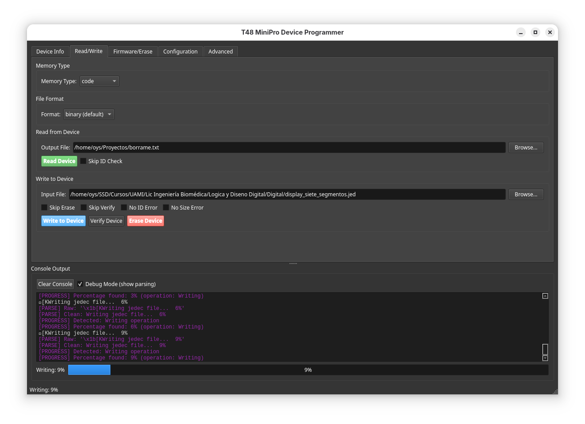
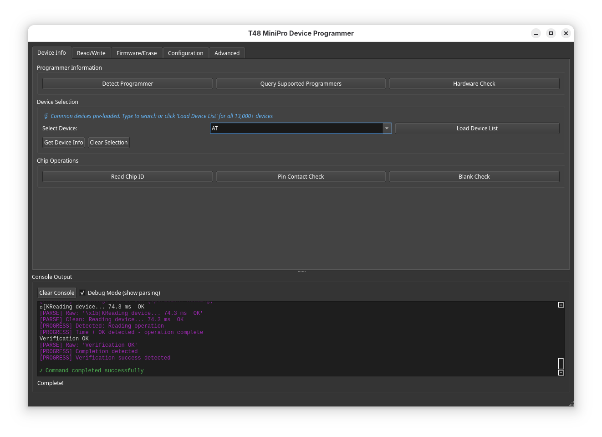
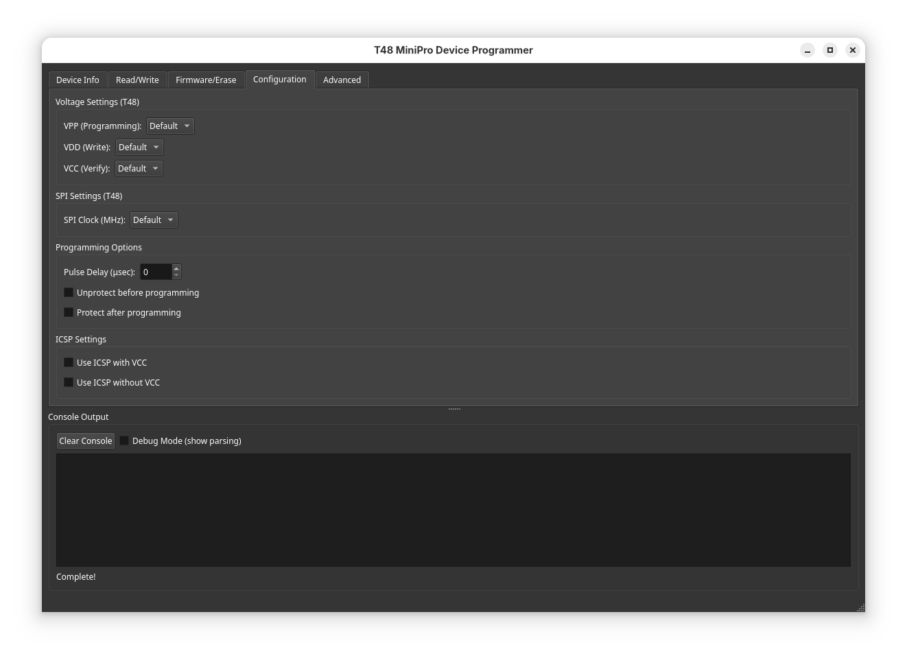

# T48 MiniPro Device Programmer GUI

A modern PyQt6 frontend for the `minipro` command-line tool, providing an intuitive graphical interface for programming chips with the T48 device programmer.

> **Important:** This is a GUI frontend for [minipro](https://gitlab.com/DavidGriffith/minipro), the open-source programmer software. You must have minipro installed for this GUI to work. Visit the [minipro GitLab repository](https://gitlab.com/DavidGriffith/minipro) for installation instructions.


## ✨ Latest Features (v1.3.3)

### 🎯 Searchable Device Dropdown
- **Pre-loaded Common Devices**: 40+ popular chips (EEPROM, EPROM, SPI Flash, GAL/PAL, MCUs)
- **Type-to-Filter**: Instant search through devices as you type
- **Load All 13,000+ Devices**: On-demand loading with background processing
- **Smart Autocomplete**: Finds matches anywhere in device name

### 📊 Real-Time Progress Bar
- **Live Updates**: See actual progress as operations execute (0% → 25% → 50% → 100%)
- **Smart Parsing**: Automatically detects minipro's output format
- **Operation Status**: Shows current action (Reading, Writing, Verifying, Erasing)
- **Completion Detection**: Knows when operations finish successfully

### 💾 Persistent Settings
- **Remember Everything**: Last device, file paths, directories, window position
- **Smart File Browser**: Opens in your last-used directory
- **Session Restore**: Pick up exactly where you left off
- **All Local**: Settings stored on your computer only

### 🔍 Debug Mode
- **Progress Analysis**: See exactly what the parser detects
- **Output Inspection**: View raw minipro output with color-coding
- **Troubleshooting**: Identify issues with progress detection
- **Toggle On/Off**: Enable when needed, hide when not

### 🎨 Streamlined Interface
- **One-Click Erase**: Erase button right in Read/Write tab
- **Cleaner Layout**: Reduced clutter, improved workflow
- **Color-Coded Console**: Cyan commands, green success, red errors, purple debug
- **Auto-Hide Progress**: Progress bar disappears after completion

## 📸 Screenshots

### Main Interface

*Device selection with searchable dropdown and programmer detection*

### Real-Time Progress

*Live progress updates with debug mode showing parsing details*

### Searchable Device Dropdown

*Type to filter through 13,000+ supported devices instantly*

### Device Configuration

*Set operating parameters of the programmer*

## Core Features

### 🔍 Device Management
- **Programmer Detection**: Automatically detect and query connected T48 programmers
- **Device Search**: Searchable dropdown with 13,000+ supported devices
- **Chip Information**: View detailed device specifications and capabilities
- **Chip ID Reading**: Read and verify chip identification
- **Pin Contact Check**: Verify proper chip insertion and contact

### 📝 Read/Write Operations
- **Memory Reading**: Read code, data, config, user, and calibration memory
- **Memory Writing**: Write firmware and data to devices
- **Verification**: Verify written data against source files
- **Device Erase**: Quick erase button in Read/Write tab
- **Multiple Formats**: Support for binary, Intel HEX, and Motorola S-Record formats
- **Flexible Options**: Skip erase, skip verify, ignore ID mismatches, and more

### ⚡ Firmware Management
- **Blank Check**: Verify if device is erased
- **Device Erase**: Complete chip erase operations (also in Read/Write tab)
- **Firmware Update**: Update T48 programmer firmware safely

### ⚙️ Configuration
- **Voltage Control**: Precise VPP, VDD, and VCC voltage settings (9V-25V range)
- **SPI Settings**: Configurable SPI clock speeds (4MHz-30MHz for T48)
- **Programming Options**: Pulse delay, protection, and ICSP settings
- **Logic Testing**: RAM and Logic IC testing capabilities

### 🎨 User Interface
- **Dark Theme**: Modern, eye-friendly dark interface
- **Real-time Console**: Live command output with color-coded messages
- **Real-time Progress**: Smooth progress bar updates during operations
- **Tabbed Layout**: Organized workflow across multiple tabs
- **Smart File Dialogs**: Remember last directories and files
- **Session Persistence**: Restore your workspace on launch

## Prerequisites

### Required Software

1. **Python 3.8 or higher**
   ```bash
   python3 --version
   ```

2. **minipro CLI tool**
   
   The GUI is a frontend for `minipro`, which must be installed separately:
   
   **Linux (Debian/Ubuntu):**
   ```bash
   sudo apt-get update
   sudo apt-get install minipro
   ```
   
   **From Source:**
   ```bash
   git clone https://gitlab.com/DavidGriffith/minipro.git
   cd minipro
   make
   sudo make install
   ```

3. **PyQt6**
   ```bash
   pip install PyQt6
   ```

### Hardware
- Xgecu T48 (or TL866A/CS, TL866II+, T56, T76) device programmer
- USB connection to your computer
- Target chip/device to program

## Installation

### Option 1: Quick Start

1. **Clone or download** this repository
2. **Install PyQt6:**
   ```bash
   pip install PyQt6
   ```
3. **Run the application:**
   ```bash
   python3 minipro_gui.py
   ```

### Option 2: Virtual Environment (Recommended)

```bash
# Create virtual environment
python3 -m venv venv

# Activate it
source venv/bin/activate  # Linux/Mac
# or
venv\Scripts\activate     # Windows

# Install dependencies
pip install PyQt6

# Run the application
python3 minipro_gui.py
```

## Usage Guide

### 1. Initial Setup

**Connect Your Programmer:**
1. Plug in your T48 programmer via USB
2. Go to **Device Info** tab
3. Click **"Detect Programmer"**
4. Verify your programmer is recognized

### 2. Select Your Device

**Use the Searchable Dropdown:**
1. Click the device dropdown (shows common devices by default)
2. Start typing to filter (e.g., "AT29" shows all AT29xxx chips)
3. Select your device from the list
4. Or click **"Load Device List"** for all 13,000+ devices

**Common Pre-loaded Devices:**
- EEPROM: AT28C256, AT29C256, AT29C512
- EPROM: 27C64, 27C128, 27C256, 27C512
- SPI Flash: W25Q32JV, W25Q64JV, W25Q128JV
- GAL/PAL: GAL16V8, GAL16V8D, GAL20V8, GAL22V10
- MCUs: ATMEGA328P, PIC16F628A, PIC16F877A

**Get Device Details:**
- Click **"Get Device Info"** to see specifications and voltage requirements

### 3. Reading from a Device

1. **Device already selected** (from dropdown)
2. Go to **Read/Write tab**
3. **Select memory type** (code, data, config, etc.)
4. **Choose output format** (binary, ihex, srec)
5. **Browse for output file** location (opens in last-used directory)
6. **Optional:** Check "Skip ID Check" if needed
7. **Click "Read Device"**
8. **Watch progress bar** update in real-time (0% → 100%)
9. **Monitor progress** in the console

### 4. Writing to a Device

1. **Device already selected** (from dropdown)
2. Go to **Read/Write tab**
3. **Select your input file** with "Browse..." (opens in last directory)
4. **Choose memory type** if needed
5. **Configure options:**
   - Skip Erase (preserve existing data)
   - Skip Verify (faster but not recommended)
   - No ID Error (ignore chip ID mismatches)
6. **Go to Configuration tab** if you need to set voltages
7. **Return to Read/Write tab**
8. **Click "Write to Device"**
9. **Confirm the operation**
10. **Watch real-time progress** (Writing: 0% → 100%)
11. **Wait for completion and verification**

### 5. Quick Erase

**Right in the Read/Write tab:**
1. Device selected
2. Click **"Erase Device"** (red button)
3. **Confirm** (data will be permanently deleted!)
4. **Watch progress** in real-time

### 6. Configuration (Advanced)

**Voltage Settings:**
- Set **VPP** for programming voltage (9V-25V)
- Set **VDD** for write voltage (3.3V-6.5V)
- Set **VCC** for verify/test voltage

**SPI Configuration:**
- For SPI Flash chips, set clock speed (4/8/15/30 MHz)

**Protection:**
- Check "Unprotect before programming" to disable write protection
- Check "Protect after programming" to enable write protection

**ICSP Options:**
- Use ICSP with or without VCC for in-circuit programming

### 7. Advanced Features

**Logic/RAM Testing:**
1. Go to **Advanced** tab
2. Select your IC in Device Info
3. Click **"Run Logic Test"**

**Auto-Detect SPI:**
1. Go to **Advanced** tab
2. Choose 8-bit or 16-bit bus
3. Click **"Auto-Detect"**

**Custom Commands:**
1. Go to **Advanced** tab
2. Enter any minipro command arguments
3. Click **"Execute"**

## Tips & Best Practices

### ✅ DO:
- Use the searchable dropdown - type to filter devices instantly
- Enable Debug Mode if progress bar isn't updating correctly
- Let the app remember your settings - it saves time
- Watch the real-time progress bar during operations
- Always verify programmer connection first
- Use "Get Device Info" to confirm voltage requirements
- Start with "Read Chip ID" to verify chip is inserted correctly
- Perform "Blank Check" before writing to new chips
- Use "Verify" after writing to confirm success
- Keep backups of original firmware before writing

### ❌ DON'T:
- Write to a device without verifying the correct chip is inserted
- Disconnect during firmware updates or programming operations
- Use incorrect voltage settings (check device datasheet)
- Skip verification on critical applications
- Erase devices without confirming you have backups
- Ignore warnings about chip ID mismatches

### 🚀 Pro Workflow Tips:

**Quick Programming Workflow:**
1. Select device from dropdown (remembered from last time)
2. Files already filled in (from last session)
3. Click "Erase" → "Write" → done! (all in one tab)

**Using Debug Mode:**
- Enable when testing new devices or troubleshooting
- See purple `[PARSE]` lines showing what's detected
- Watch `[PROGRESS]` messages showing percentage updates
- Disable for normal use to reduce console clutter

**Smart File Management:**
- Browse once, directory is remembered
- File paths persist between sessions
- No need to re-enter paths every time

**Device Selection:**
- Common devices pre-loaded for instant access
- Type partial name to filter (e.g., "W25Q" finds all W25Q devices)
- Click "Load Device List" only when needed
- Selection is saved for next session

## Console Output & Progress

### Progress Bar
The progress bar shows real-time updates during operations:
- **0% → 25% → 50% → 75% → 100%** - Smooth updates as minipro works
- **Operation Status** - Shows current action (Reading, Writing, Verifying, Erasing)
- **Auto-Hide** - Disappears 2 seconds after completion
- **Debug Mode** - Enable to see detailed parsing information

### Console Colors
- 🔵 **Cyan** - Commands being executed
- ⚪ **White** - Normal minipro output
- 🟣 **Purple** - Debug parsing info (when Debug Mode enabled)
- 🟢 **Green** - Success messages
- 🔴 **Red** - Errors and warnings

### Debug Mode
Enable "Debug Mode (show parsing)" checkbox to see:
- `[PARSE]` - Raw output lines from minipro
- `[PROGRESS]` - What the parser detected and calculated
- Real-time progress parsing as it happens
- Helpful for troubleshooting progress bar issues

Click **"Clear Console"** to clean up the output window.

## Troubleshooting

### "Command not found: minipro"
**Solution:** Install the minipro CLI tool (see Prerequisites section)

### "No programmer found"
**Solutions:**
- Check USB connection
- Try a different USB port
- Check USB permissions (Linux): `sudo usermod -a -G dialout $USER` then log out/in
- Verify driver installation (Windows)
- Try powered USB hub if using USB 3.0

### "Device ID mismatch"
**Solutions:**
- Verify correct chip is inserted
- Check chip orientation (pin 1 alignment)
- Try cleaning chip pins
- Use "No ID Error" option if ID is known to be different but compatible

### Progress Bar Not Updating
**Solutions:**
1. Enable "Debug Mode" checkbox to see what's being parsed
2. Check console for purple `[PARSE]` and `[PROGRESS]` messages
3. If no debug messages appear, minipro may not be outputting progress
4. Make sure you're running the latest version (v1.3.3+)
5. Try a different operation (some are very fast and show 0→100 instantly)

### Debug Mode Shows No Output
**Issue:** No purple `[PARSE]` lines when Debug Mode is on
**Solution:** This was fixed in v1.3.3 - make sure you have the latest version

### Progress Jumps 0% to 100% Instantly
**Possible Causes:**
- Operation is very fast (< 1 second) - normal for small chips
- Device doesn't output progress for this operation
- Buffering issue (should be fixed in v1.3.3+)

### "File not found" errors
**Solution:** Use absolute paths or browse with the file dialog

### Device Not in Dropdown
**Solutions:**
1. Click "Load Device List" to fetch all 13,000+ devices
2. Or manually type the device name (it will still work)
3. Make sure minipro supports your device: `minipro -L "devicename"`

### Settings Not Saving
**Issue:** Preferences don't persist between sessions
**Solution:** 
- Settings save automatically on close
- Check permissions: `~/.config/MiniProGUI/` (Linux)
- Delete config file to reset: `rm ~/.config/MiniProGUI/T48Programmer.conf`

### GUI won't start
**Solutions:**
- Verify PyQt6 installation: `pip install PyQt6`
- Check Python version: `python3 --version` (need 3.8+)
- Try: `python3 -m PyQt6.QtCore` to test PyQt6
- Check for error messages in terminal

### Permission denied (Linux)
**Solution:**
```bash
sudo chmod +x minipro_gui.py
# Or add your user to dialout group:
sudo usermod -a -G dialout $USER
# Then log out and back in
```

### Wayland Warning on Linux
**Issue:** `qt.qpa.plugin: Could not find the Qt platform plugin "wayland"`
**Solution:** This is fixed in v1.0.1+ - update to latest version

## Command Reference

The GUI generates `minipro` commands based on your selections. Here are common operations:

```bash
# Read device
minipro -p "AT29C256@DIP28" -r output.bin

# Write device
minipro -p "AT29C256@DIP28" -w input.bin

# Write with options
minipro -p "W25Q32JV@SOIC8" -w firmware.bin --vpp 12 --spi_clock 30

# Erase device
minipro -p "AT29C256@DIP28" -E

# Verify
minipro -p "AT29C256@DIP28" -m verify.bin

# Logic test
minipro -p "7404@DIP14" -T

# Read chip ID
minipro -p "AT29C256@DIP28" -D
```

## Technical Details

### Supported Memory Types
- **code**: Program memory (default)
- **data**: Data EEPROM
- **config**: Configuration fuses/bits
- **user**: User memory/encryption table
- **calibration**: Calibration bytes (AVR-specific, read-only)

### Supported File Formats
- **Binary** (.bin): Raw binary data
- **Intel HEX** (.hex): Intel HEX format (ihex8/ihex16/ihex32 auto-detected)
- **Motorola S-Record** (.srec): S-record format

### T48 Voltage Ranges
- **VPP**: 9V, 9.5V, 10V, 11V, 11.5V, 12V, 12.5V, 13V, 13.5V, 14V, 14.5V, 15.5V, 16V, 16.5V, 17V, 18V, 21V, 25V
- **VDD/VCC**: 3.3V, 4V, 4.5V, 5V, 5.5V, 6.5V

### T48 SPI Clock Speeds
- 4 MHz
- 8 MHz
- 15 MHz
- 30 MHz

## Known Limitations

- Some T56/T76 specific features are experimental
- Custom pinout chips require modification of infoic.xml
- Network operations (firmware downloads) must be done manually
- Multi-threading for GUI responsiveness (commands run asynchronously)

## Contributing

Contributions welcome! Areas for improvement:
- Additional programmer support (T56/T76 specific features)
- Preset configurations for common chips
- Batch operations
- Progress bars for long operations
- Device database integration
- Hex editor for viewing/editing files

## Resources

- **minipro GitLab**: https://gitlab.com/DavidGriffith/minipro/
- **Xgecu Website**: http://www.xgecu.com/en/
- **minipro Documentation**: Check man page with `man minipro`
- **Firmware Updates**: https://github.com/Kreeblah/XGecu_Software

## Related Projects

### minipro - The Core Tool
This GUI is a frontend for [minipro](https://gitlab.com/DavidGriffith/minipro/), an open-source command-line tool for controlling Xgecu chip programmers. 

**minipro features:**
- Support for 13,000+ devices (EEPROM, EPROM, Flash, MCUs, GAL/PAL, etc.)
- Compatible with TL866A/CS, TL866II+, T48, T56, and T76 programmers
- Multiple file formats (binary, Intel HEX, Motorola S-Record)
- Active development and community support

**Credits:**
- Created by Valentin Dudouyt (2014)
- Maintained by David Griffith and contributors
- Licensed under GPLv3

**Installation:**
```bash
# Debian/Ubuntu
sudo apt-get install minipro

# From source
git clone https://gitlab.com/DavidGriffith/minipro.git
cd minipro
make
sudo make install
```

### Why This GUI?
While minipro is powerful, command-line usage can be challenging for:
- Users who prefer graphical interfaces
- Repetitive operations (no need to retype commands)
- Visual feedback (real-time progress bars)
- Device discovery (searchable dropdown of 13,000+ devices)
- Settings management (remembers your preferences)

This GUI makes minipro's power accessible to everyone while maintaining all the flexibility of the command-line tool.

## License

This GUI application is distributed under the GNU General Public License v3.0 (GPLv3), matching the minipro project license.

The underlying `minipro` tool is:
- Created by Valentin Dudouyt (2014)
- Maintained by David Griffith and contributors
- Licensed under GPLv3

## Credits

**GUI Application:** Built by Oscar Yanez with PyQt6 for the T48 programming community

**Underlying Tool:** The `minipro` open-source project by David Griffith and contributors

**Hardware:** Xgecu T48 and compatible programmers

## Disclaimer

This software is provided as-is with no warranty. Always verify your operations, keep backups, and refer to device datasheets for correct programming parameters. The authors are not responsible for damaged chips or programmers resulting from incorrect usage.

## Version History

### v1.3.3 (Current - February 14, 2026)
- 🐛 **FIXED**: Progress bar now updates in real-time!
- 🔧 Read from stderr where minipro outputs progress
- 📊 Smooth progress updates: 0% → 25% → 50% → 75% → 100%
- ⚡ Character-by-character reading with select() multiplexing
- 🎯 Proper ANSI escape sequence handling

### v1.3.0-1.3.2 (February 14, 2026)
- 🗑️ Added Erase button to Read/Write tab
- 💾 Persistent settings with QSettings
- 🎯 Remember device, files, directories, window position
- 🔍 Enhanced debug mode for progress troubleshooting
- ⚙️ Improved progress parsing algorithms

### v1.2.1 (February 14, 2026)
- 🐛 Fixed missing devices in dropdown (devices without @ package)
- 📋 Added GAL/PAL devices to common list

### v1.2.0 (February 14, 2026)
- ✨ Searchable device dropdown with autocomplete
- 📋 Pre-loaded 40+ common devices
- 🚀 Background loading of full device list (13,000+)
- 🎨 Cleaner device selection interface

### v1.1.0 (February 14, 2026)
- ✨ Progress bar with smart output parsing
- 🎨 Visual feedback during operations
- ⏱️ Auto-hide progress bar after completion

### v1.0.1 (February 14, 2026)
- 🐛 Fixed QColor TypeError in console output
- 🐛 Fixed Wayland platform warning on Linux

### v1.0.0 (February 14, 2026)
- 🎉 Initial release
- Full minipro feature support
- Dark theme UI
- All basic operations (read, write, verify, erase)
- Configuration and voltage settings
- Logic testing and advanced features
